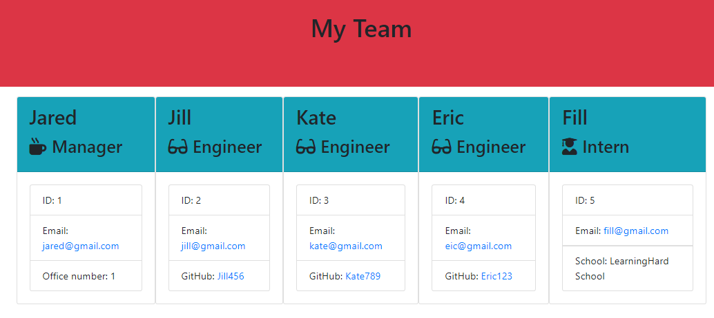

# Team-Profile-Generator
Create a command-line application to generate team members HTML file using Node.js.

## Description
The main task of this Project is to create a command-line application using Node.js. Based on the prompts provided the manager will be able to create an HTML file with the information about the team - himself, engineers and interns. This application is easy to use - just answer a simple questions about the team member, though they can be modified to display more explicit info. It is also a time-saving app, as it allows to see the whole picture not to bothering much. 
It was a good practice in istalling and using Node.js and npm packages. Using Jest packages it was possible to make sure every provided test wass passed. And this made the code work.

## Instalation
No installation needed however in order to run this project Node.js and npm packages provided must be installed.

## Usage
To get started with this command-line application user has to be familiar with Node.js. After typing "node + the name of the file" command in the terminal the user will get questions to answer one by one. First, the app will guide you through questions about manager, then you can add engineers and an intern(s) if you have ones in your team. 
And the final step: you will have an option to finish building team after all members are added. All the data provided will be generated into an HTML file to show the structure of the team.

## Credits
N/A

## License
Please refer to the license in the repo.

